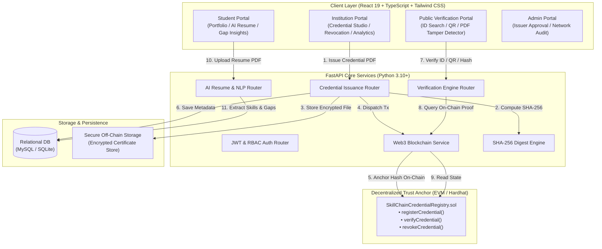
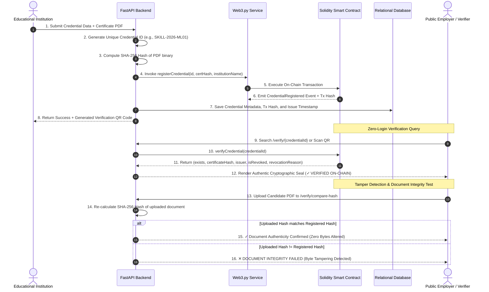
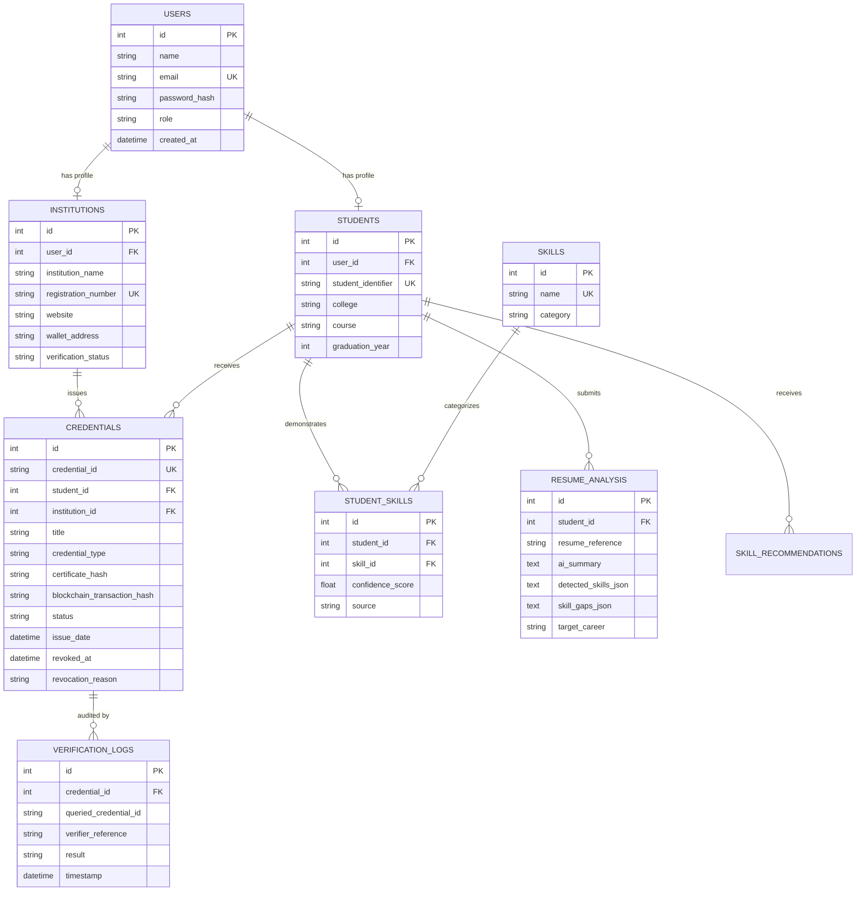

# SkillChain: Decentralized Credential Verification & AI Skill Intelligence Platform

[](https://opensource.org/licenses/MIT)
[](https://react.dev/)
[](https://fastapi.tiangolo.com/)
[](https://soliditylang.org/)
[](https://hardhat.org/)
[](https://tailwindcss.com/)
[](https://skillchain-platform-lac.vercel.app)

> **"Proof of Skills. Powered by Blockchain."**  
> An enterprise-grade, decentralized credential issuance, instant verification, and AI-driven skill gap intelligence ecosystem.

---

## Table of Contents
1. [Executive Summary & Problem Statement](#1-executive-summary--problem-statement)
2. [Dual-Pillar Core Architecture](#2-dual-pillar-core-architecture)
3. [System Architecture & Visual Diagrams](#3-system-architecture--visual-diagrams)
   - [High-Level System Topology](#high-level-system-topology)
   - [Verification & Cryptographic Tamper-Detection Sequence](#verification--cryptographic-tamper-detection-sequence)
   - [Role-Based Access Control (RBAC) Matrix](#role-based-access-control-rbac-matrix)
4. [Deep-Dive: Smart Contract & Blockchain Layer (`blockchain/`)](#4-deep-dive-smart-contract--blockchain-layer-blockchain)
   - [Smart Contract Specification (`SkillChainCredentialRegistry.sol`)](#smart-contract-specification-skillchaincredentialregistrysol)
   - [State Variables & Cryptographic Structs](#state-variables--cryptographic-structs)
   - [Core Functions & Access Modifiers](#core-functions--access-modifiers)
   - [Blockchain Service & Web3 Client (`blockchain_service.py`)](#blockchain-service--web3-client-blockchain_servicepy)
5. [Deep-Dive: Backend API & AI Intelligence Services (`backend/`)](#5-deep-dive-backend-api--ai-intelligence-services-backend)
   - [FastAPI Microservices Architecture](#fastapi-microservices-architecture)
   - [AI Resume Parsing & Skill Intelligence Engine (`ai_service.py`)](#ai-resume-parsing--skill-intelligence-engine-ai_servicepy)
   - [Cryptographic Digest Engine & Tamper Detection (`crypto_utils.py`)](#cryptographic-digest-engine--tamper-detection-crypto_utilspy)
   - [Comprehensive REST API Route Catalog](#comprehensive-rest-api-route-catalog)
6. [Deep-Dive: Relational Database Models & Schema (`entities.py`)](#6-deep-dive-relational-database-models--schema-entitiespy)
   - [Entity Relationship Diagram (ERD)](#entity-relationship-diagram-erd)
   - [Database Table Schema Breakdown](#database-table-schema-breakdown)
7. [Deep-Dive: Frontend Client Application (`frontend/`)](#7-deep-dive-frontend-client-application-frontend)
   - [UI/UX Philosophy & Modern React 19 Architecture](#uiux-philosophy--modern-react-19-architecture)
   - [Comprehensive Page Catalog & Feature Descriptions](#comprehensive-page-catalog--feature-descriptions)
   - [Dynamic Multi-Theme System](#dynamic-multi-theme-system)
   - [Dual-Mode Fallback & High-Availability Engine (`mockStore.ts`)](#dual-mode-fallback--high-availability-engine-mockstorets)
8. [Installation & Local Deployment Guide](#8-installation--local-deployment-guide)
9. [Verification Walkthrough & Testing Scenarios](#9-verification-walkthrough--testing-scenarios)
10. [Pre-Seeded Demo Accounts & Credentials](#10-pre-seeded-demo-accounts--credentials)
11. [Security, Privacy & Compliance Model](#11-security-privacy--compliance-model)
12. [Future Roadmap & Advanced Extensions](#12-future-roadmap--advanced-extensions)

---

## 1. Executive Summary & Problem Statement

### The Problem
- **Rampant Credential Fraud:** Traditional paper and digital PDF certificates are trivial to forge or alter using basic graphic software. Employers and background check firms struggle with forged degrees, fake certificates, and inflated resumes.
- **Slow, Centralized Verification:** Conventional verification processes rely on manual email exchanges, paper transcripts, or third-party background checking agencies that charge substantial fees and take days or weeks.
- **Privacy Breaches in Web3:** Naive blockchain implementations frequently record Personally Identifiable Information (PII) directly onto public ledgers, violating strict data privacy laws such as **GDPR** and **FERPA**.
- **Opaque Resume Claims:** Recruiters have difficulty quantifying whether a candidate's listed skills reflect genuine verified coursework or unproven claims.

### The SkillChain Solution
SkillChain combines an **Ethereum Virtual Machine (EVM) blockchain trust anchor** with an **automated AI Skill Intelligence engine** to deliver:
1. **Instant, Zero-Login Verification:** Verifiers can validate certificates in under 50 milliseconds via unique Credential IDs, camera QR code scans, or direct PDF drag-and-drop.
2. **Byte-Level Tamper Detection:** Any alteration—even changing a single pixel or comma—generates a distinct cryptographic SHA-256 digest that fails comparison against the immutable on-chain root.
3. **Strict Zero-Knowledge Data Privacy:** Personal documents, student identifiers, and grades remain strictly off-chain in secure storage. Only cryptographic hashes and issuer timestamps touch the blockchain.
4. **AI-Driven Competency Analytics:** Uploaded resumes and verified achievements are automatically parsed by Natural Language Processing (NLP) models to calculate skill confidence scores, benchmark candidates against target industry roles, and generate actionable learning roadmaps.

---

## 2. Dual-Pillar Core Architecture

```
                  ┌────────────────────────────────────────────────────────┐
                  │                    SKILLCHAIN PLATFORM                 │
                  └───────────────────────────┬────────────────────────────┘
                                              │
                    ┌─────────────────────────┴─────────────────────────┐
                    ▼                                                   ▼
     ┌─────────────────────────────┐                     ┌─────────────────────────────┐
     │   BLOCKCHAIN TRUST LAYER    │                     │ AI SKILL INTELLIGENCE LAYER │
     ├─────────────────────────────┤                     ├─────────────────────────────┤
     │ • EVM Solidity Registry     │                     │ • Resume & PDF Text Parser  │
     │ • Immutable SHA-256 Hashes  │                     │ • Skill Extraction (NLP)    │
     │ • Authorized Issuers (RBAC) │                     │ • Confidence Scoring        │
     │ • Instant On-Chain Revoke   │                     │ • Role Benchmark Gaps       │
     │ • Public Audit Trail        │                     │ • Priority Learning Actions │
     └─────────────────────────────┘                     └─────────────────────────────┘
```

1. **Pillar 1: Blockchain Trust Layer:** An EVM smart contract acts as the decentralized single source of truth for credential authenticity. Once an authorized institution issues a certificate, its cryptographic digest is permanently anchored. Even if the issuing platform's database goes offline, any third-party verifier can independently validate the certificate against the blockchain.
2. **Pillar 2: AI Skill Intelligence Layer:** Raw credentials and candidate resumes are parsed to identify verified competencies (e.g., PyTorch, Docker, Solidity). The engine calculates weighted confidence scores, compares competencies against industry standards (e.g., Machine Learning Engineer, Cloud Architect), highlights missing skill gaps, and recommends prioritized learning actions.

---

## 3. System Architecture & Visual Diagrams

### High-Level System Topology



---

### Verification & Cryptographic Tamper-Detection Sequence



---

### Role-Based Access Control (RBAC) Matrix

| User Role | Credentials Query | Credential Issuance | Credential Revocation | AI Resume Parsing | Institution Authorization | Audit Stream Inspection |
| :--- | :---: | :---: | :---: | :---: | :---: | :---: |
| **Public / Verifier** | Yes | No | No | No | No | No |
| **Student** | Yes (Own) | No | No | Yes | No | No |
| **Institution** | Yes (Issued) | Yes | Yes (Own) | No | No | No |
| **Administrator** | Yes (All) | Yes | Yes (Any) | Yes | Yes | Yes |

---

## 4. Deep-Dive: Smart Contract & Blockchain Layer (`blockchain/`)

The blockchain layer guarantees that credential records cannot be altered, backdated, or deleted by any central server or database administrator.

### Smart Contract Specification (`SkillChainCredentialRegistry.sol`)
- **Language & Compiler:** Solidity `^0.8.24`
- **Architecture:** Minimalist state footprint storing only 32-byte cryptographic hashes, addresses, timestamps, and boolean flags.
- **Network Compatibility:** Ethereum Mainnet, Sepolia, Arbitrum, Optimism, Polygon Amoy, and local Hardhat.

#### State Variables & Cryptographic Structs
```solidity
struct CredentialRecord {
    string credentialId;        // Unique identifier (e.g. SKILL-2026-ML01)
    string certificateHash;     // SHA-256 Hex Digest of certificate PDF
    address issuer;             // Ethereum address of issuing institution
    string institutionName;     // Official accredited name
    uint256 issueTimestamp;     // Block timestamp of issuance
    bool exists;                // Existence guard flag
    bool isRevoked;             // Revocation flag
    uint256 revokedTimestamp;   // Block timestamp of revocation (0 if active)
    string revocationReason;    // Audit explanation for revocation
}

address public admin;
mapping(address => bool) public authorizedIssuers;
mapping(address => string) public issuerNames;
mapping(string => CredentialRecord) private credentials;
```

#### Core Functions & Access Modifiers
1. **`onlyAdmin` Modifier:** Restricts execution strictly to the platform contract owner.
2. **`onlyAuthorizedIssuer` Modifier:** Restricts execution to vetted institutions whitelisted by the admin.
3. **`authorizeIssuer(address issuer, string calldata institutionName)`:** Approves an institution to issue credentials on the registry.
4. **`deauthorizeIssuer(address issuer)`:** Immediately revokes an institution's issuing privileges.
5. **`registerCredential(string calldata credentialId, string calldata certificateHash, string calldata institutionName)`:** Anchors a new credential's cryptographic digest into the registry. Emits `CredentialRegistered`.
6. **`revokeCredential(string calldata credentialId, string calldata reason)`:** Marks a credential as revoked. Restricted to the credential's original issuing address or platform admin. Emits `CredentialRevoked`.
7. **`verifyCredential(string calldata credentialId)`:** Constant view function that returns all on-chain verification parameters without consuming gas.
8. **`verifyHashIntegrity(string calldata credentialId, string calldata computedHash)`:** Performs an in-EVM string hash comparison (`keccak256`) returning a boolean match flag.

---

### Blockchain Service & Web3 Client (`blockchain_service.py`)
Located in `backend/app/blockchain/blockchain_service.py`, this service acts as the production bridge between the FastAPI server and the EVM smart contract:
- **Automatic ABI & Deployment Discovery:** Resolves contract addresses and ABIs dynamically from `blockchain/deployment-info.json` or Hardhat artifacts.
- **Nonce & Gas Management:** Tracks issuer account nonces to prevent race conditions during rapid issuance, queries dynamic gas prices via `w3.eth.gas_price`, and signs transactions off-chain using the institution's private key.
- **Synchronous Receipt Confirmation:** Awaits transaction inclusion in a block (`wait_for_transaction_receipt`) with timeout safeguards.
- **Resilient Fallback Mode:** If the local blockchain node is not running, the service automatically logs the state and provides seamless cryptographic simulation so application evaluation is never interrupted.

---

## 5. Deep-Dive: Backend API & AI Intelligence Services (`backend/`)

### FastAPI Microservices Architecture
The backend is built with **FastAPI** (Python 3.10+), utilizing asynchronous request handling, Pydantic type validation, and SQLAlchemy ORM.

```
backend/
├── app/
│   ├── ai/
│   │   └── ai_service.py              # NLP Resume Parser, Skill Classifier & Gap Engine
│   ├── api/
│   │   ├── admin_router.py            # Platform metrics, institution whitelist & audit
│   │   ├── ai_router.py               # AI resume upload & analysis endpoints
│   │   ├── auth_router.py             # User registration, login, JWT token generation
│   │   ├── credentials_router.py      # Issue, filter, and revoke credentials
│   │   ├── institution_router.py      # Institution profiles & issuance statistics
│   │   ├── student_router.py          # Student portfolios, skills & transcripts
│   │   └── verification_router.py     # Public ID lookup, QR resolution, tamper check
│   ├── auth/
│   │   └── auth_handler.py            # JWT encoding/decoding, bcrypt password hashing
│   ├── blockchain/
│   │   └── blockchain_service.py      # Web3.py smart contract interaction layer
│   ├── config/
│   │   ├── database.py                # Database connection pooling & declarative base
│   │   └── settings.py                # Environment configuration & secret keys
│   ├── models/
│   │   └── entities.py                # SQLAlchemy relational entity models
│   ├── schemas/
│   │   └── schemas.py                 # Pydantic request & response validation schemas
│   └── utils/
│       ├── crypto_utils.py            # SHA-256 byte hashing & formatting utilities
│       └── seeder.py                  # Database seeder with realistic test data
└── main.py                            # Application entry point, CORS & lifecycle events
```

---

### AI Resume Parsing & Skill Intelligence Engine (`ai_service.py`)
The AI engine provides automated technical skill verification and gap analysis:
1. **Document Text Extraction:** Utilizes `PyPDF2` to extract clean text streams from uploaded PDF resumes.
2. **Contextual Skill Extraction:** Scans candidate documents against comprehensive technical taxonomies:
   - **AI / Machine Learning:** PyTorch, TensorFlow, Scikit-Learn, Computer Vision, NLP, Hugging Face, Deep Learning.
   - **Backend & Cloud:** Python, FastAPI, Docker, Kubernetes, AWS, PostgreSQL, Redis, Microservices, CI/CD.
   - **Frontend & Web:** React, TypeScript, Next.js, Node.js, Tailwind CSS, GraphQL.
   - **Blockchain & Web3:** Solidity, Web3.py, Hardhat, Ethers.js, Smart Contracts, Cryptography.
3. **Statistical Confidence Scoring:** Computes confidence ratings (70% - 96%) based on keyword frequency, project associations, and verified institutional credentials.
4. **Career Benchmark Gap Analysis:** Compares candidate competencies against industry standards (e.g., *Machine Learning Engineer*, *Full Stack Web3 Developer*), identifies missing prerequisites (e.g., MLOps, Containerization), and produces structured recommendations with priorities (`HIGH`, `MEDIUM`, `LOW`).

---

### Cryptographic Digest Engine & Tamper Detection (`crypto_utils.py`)
- **Deterministic Digest Calculation:**
  $$\text{Hash} = \text{SHA-256}(\text{Binary Content})$$
- Generates a 64-character hexadecimal digest representing the certificate's unique cryptographic identity.
- **Tamper Detection Logic:** When a verifier uploads a document for integrity inspection, the backend streams the raw bytes through `hashlib.sha256()`. If even a single byte differs from the original issued document, the resulting hash completely diverges due to the cryptographic avalanche effect.

---

### Comprehensive REST API Route Catalog

| HTTP Method | Endpoint | Access Level | Description |
| :--- | :--- | :--- | :--- |
| **POST** | `/api/auth/register` | Public | Register a new user (`STUDENT`, `INSTITUTION`, `ADMIN`). |
| **POST** | `/api/auth/login` | Public | Authenticate credentials and receive a JWT Bearer token. |
| **GET** | `/api/auth/me` | Authenticated | Retrieve current user profile and role details. |
| **POST** | `/api/credentials/issue` | Institution / Admin | Issue new credential, compute SHA-256, anchor on-chain. |
| **GET** | `/api/credentials/` | Authenticated | Query credentials with status and role filtering. |
| **GET** | `/api/credentials/{credential_id}` | Authenticated | Fetch comprehensive metadata for a specific credential. |
| **POST** | `/api/credentials/revoke` | Issuer / Admin | Revoke credential on blockchain and update database status. |
| **GET** | `/api/verify/{credential_id}` | Public | Public verification lookup querying both blockchain and DB. |
| **POST** | `/api/verify/compare-hash` | Public | Upload a PDF to test bit-level integrity against on-chain root. |
| **GET** | `/api/verify/logs` | Admin | Retrieve tamper audit and query history. |
| **POST** | `/api/ai/parse-resume` | Student / Admin | Upload PDF resume to extract skills, gaps, and roadmap. |
| **GET** | `/api/students/profile` | Student | Fetch student profile and educational history. |
| **GET** | `/api/students/skills` | Student | Fetch verified skills with AI confidence percentages. |
| **GET** | `/api/students/recommendations` | Student | Fetch AI career recommendations and learning roadmaps. |
| **GET** | `/api/institution/profile` | Institution | Fetch institution profile and registration status. |
| **GET** | `/api/institution/issued-credentials` | Institution | Fetch list of all credentials issued by this institution. |
| **GET** | `/api/admin/metrics` | Admin | System dashboard metrics: users, credentials, nodes. |
| **POST** | `/api/admin/authorize-institution` | Admin | Whitelist an educational institution on the smart contract. |

---

## 6. Deep-Dive: Relational Database Models & Schema (`entities.py`)

### Entity Relationship Diagram (ERD)



### Database Table Schema Breakdown

1. **`users`**: Central authentication table storing email, bcrypt hash, and RBAC role (`STUDENT`, `INSTITUTION`, `ADMIN`, `VERIFIER`).
2. **`institutions`**: Accredited issuer details, registration credentials, official Ethereum wallet address, and verification state.
3. **`students`**: Student records linking user credentials with university enrollment, roll numbers, degrees, and expected graduation.
4. **`credentials`**: The primary credential registry linking students and institutions. Stores certificate title, category, issue date, SHA-256 hash digest, EVM transaction hash, and revocation timestamps.
5. **`skills` & `student_skills`**: Granular competency records linking verified achievements to recognized skills with AI confidence percentages.
6. **`resume_analysis`**: Historical record of candidate resume parsing sessions, extracted JSON skill structures, identified career gaps, and career role alignment.
7. **`skill_recommendations`**: Actionable learning recommendations generated for students based on detected skill gaps.
8. **`verification_logs`**: Immutable audit logs capturing every verification query, timestamp, queried ID, and outcome (`AUTHENTIC`, `REVOKED`, `HASH_MISMATCH`, `NOT_FOUND`).

---

## 7. Deep-Dive: Frontend Client Application (`frontend/`)

### UI/UX Philosophy & Modern React 19 Architecture
The frontend is constructed using **React 19**, **Vite**, **TypeScript**, and **Tailwind CSS**. It follows enterprise SaaS design patterns with subtle border radii, high-contrast typography, responsive layouts, and zero visual clutter.

```
frontend/src/
├── components/
│   ├── Navbar.tsx             # Responsive navigation with role indicators & theme trigger
│   ├── Sidebar.tsx            # Contextual navigation sidebar for authenticated dashboards
│   └── ThemeSelector.tsx      # Interactive 6-palette theme switcher modal
├── context/
│   ├── AuthContext.tsx        # React Context managing authentication, JWT & session state
│   └── ThemeContext.tsx       # Dynamic theme management & localStorage persistence
├── layouts/
│   └── DashboardLayout.tsx    # Unified layout wrapper with Sidebar, Navbar, and Page Outlet
├── pages/
│   ├── AboutPage.tsx          # Technical specifications & zero-knowledge security primer
│   ├── AdminDashboard.tsx     # Administrator control center & live verification audit stream
│   ├── InstitutionCredentialsPage.tsx # Credential management table with revocation modal
│   ├── InstitutionDashboard.tsx       # Institution analytics, issuance counters & activity
│   ├── InstitutionStudentsPage.tsx    # Enrolled student directory & recipient selection
│   ├── IssueCredentialPage.tsx        # Digital credential issuance studio with file upload
│   ├── LandingPage.tsx        # Public marketing page, live counters, feature walkthrough
│   ├── LoginPage.tsx          # Multi-role authentication with demo pre-fill buttons
│   ├── RegisterPage.tsx       # Student & Institution onboarding portal
│   ├── StudentCredentialsPage.tsx     # Student verified credential gallery
│   ├── StudentDashboard.tsx   # Student overview, verified skill matrix & transcript export
│   ├── StudentRecommendationsPage.tsx # AI-generated career next-step recommendations
│   ├── StudentResumePage.tsx  # PDF resume dropzone with real-time AI skill extraction
│   ├── StudentSkillsPage.tsx  # Categorized competency radar & confidence bars
│   └── VerificationPage.tsx   # Public trust portal (ID search, QR scan, PDF tamper test)
├── services/
│   ├── api.ts                 # Axios HTTP client with Bearer interceptors & auto-fallback
│   └── mockStore.ts           # In-memory reactive state simulation for offline resilience
└── types/
    └── index.ts               # Strict TypeScript interfaces for all domain entities
```

---

### Comprehensive Page Catalog & Feature Descriptions

#### 1. Public Verification Portal (`/verify`)
- **Instant Search:** Allows verifiers and employers to look up any Credential ID (e.g., `SKILL-2026-ML01`) with zero login requirements.
- **QR Code Scanner:** Camera-based QR code reader for scanning printed or mobile credentials.
- **Cryptographic File Tamper Detector:** Verifiers can drag-and-drop a candidate's PDF certificate. The portal re-calculates the SHA-256 hash and compares it directly against the on-chain root, immediately flagging any byte-level modifications.
- **Verification Seal:** Renders authentic state with an official green badge, issuer verification, transaction hash, and timestamp. Displays clear warning badges if a credential has been revoked or tampered with.

#### 2. Student Portal (`/student`)
- **Dashboard Overview:** Displays total verified credentials, competency count, and AI career readiness metrics.
- **Verified Portfolio:** Clean card grid of all issued credentials with download buttons and direct verification links.
- **Competency Matrix:** Visual confidence progress bars categorized into AI/ML, Cloud, Backend, and Web3.
- **AI Resume & Gap Intelligence (`/student/resume`):** Drag-and-drop PDF resume uploader that extracts work experience, projects, skills, and missing prerequisites against target industry roles.

#### 3. Institution Portal (`/institution`)
- **Issuance Analytics:** Visual statistics tracking total credentials issued, active recipients, and revocation rates.
- **Issue Credential Studio (`/institution/issue`):** Multi-field form for creating credentials, selecting student recipients, attaching PDF certificates, computing SHA-256 digests, and dispatching on-chain transactions.
- **Credential Lifecycle Management (`/institution/credentials`):** Comprehensive table with status filters and a secure revocation modal requiring a mandatory justification reason.

#### 4. Platform Administrator Portal (`/admin`)
- **Network Health:** Real-time metrics showing blockchain connection state, contract address, total registered institutions, and credential issuance volume.
- **Institution Whitelist:** Interface to review, approve, or deauthorize issuing institutions on the smart contract.
- **Live Audit Stream:** Real-time log stream monitoring every public verification query and tamper alert across the platform.

---

### Dynamic Multi-Theme System
SkillChain includes a multi-theme engine accessible from any page via the Theme Switcher:
1. **Modern Indigo (Default):** Professional corporate SaaS palette with rich indigo accents.
2. **Emerald Green:** Clean environmental and fintech palette with deep emerald tones.
3. **Minimalist Slate:** Monochromatic, high-clarity engineering aesthetic.
4. **Midnight Dark:** Low-light developer mode with true slate-900 contrast.
5. **Cyberpunk Neon:** High-energy Web3 aesthetic featuring neon cyan and purple accents.
6. **Ocean Blue:** Deep navy and azure corporate cloud theme.

All theme preferences are automatically saved in `localStorage` and applied across pages without page reloads.

---

### Dual-Mode Fallback & High-Availability Engine (`mockStore.ts`)
SkillChain features a hybrid architecture designed for zero downtime:
- **Online Mode:** Requests are routed through the FastAPI backend to the MySQL database and EVM smart contract.
- **Offline / Standalone Fallback:** If the backend server or blockchain node is unreachable (e.g., during live demonstrations or sandboxed client evaluation), `frontend/src/services/api.ts` automatically switches to `mockStore.ts`.
- The in-memory store maintains realistic pre-seeded data, handles login authentication, issues new credentials, computes browser-side SHA-256 hashes, and conducts tamper detection so the platform remains fully functional in any environment.

---

## 8. Installation & Local Deployment Guide

### Prerequisites
- **Node.js:** v18.0.0 or higher
- **Python:** v3.10.0 or higher
- **Git:** Latest version
- **Package Manager:** `npm` or `pnpm`

---

### Step 1: Start Hardhat Local Blockchain Node
```bash
cd blockchain
npm install
npx hardhat node
```
*The local node starts on `http://127.0.0.1:8545` with 20 pre-funded test accounts.*

---

### Step 2: Deploy the Smart Contract
Open a new terminal window:
```bash
cd blockchain
npx hardhat run scripts/deploy.js --network localhost
```
*This deploys `SkillChainCredentialRegistry.sol`, logs the contract address, and generates `deployment-info.json`.*

---

### Step 3: Run the FastAPI Backend
Open a third terminal window:
```bash
cd backend
python -m venv venv

# Windows:
venv\Scripts\activate
# Linux/macOS:
source venv/bin/activate

pip install -r requirements.txt
python -m uvicorn app.main:app --reload --port 8000
```
*The backend connects to the blockchain, initializes database tables, and seeds realistic demo data on boot.*

---

### Step 4: Run the Vite React Frontend
Open a fourth terminal window:
```bash
cd frontend
npm install
npm run dev
```
Open **`http://localhost:5173`** in your browser.

---

## 9. Verification Walkthrough & Testing Scenarios

Experience the platform's core capabilities using the following test cases:

| Scenario | Action | Expected Result |
| :--- | :--- | :--- |
| **1. Authentic Verification** | Navigate to `/verify`, search `SKILL-2026-ML01` | Displays **✓ VERIFIED ON-CHAIN**, SHA-256 digest match, issuer address, and transaction anchor. |
| **2. Revoked Credential** | Navigate to `/verify`, search `SKILL-2026-REV05` | Displays **⚠ CREDENTIAL REVOKED**, revocation audit reason, and timestamp. |
| **3. Bit-Level Tamper Test** | On `/verify`, click "Verify File Integrity", target `SKILL-2026-ML01`, and upload an edited file | Displays **✕ DOCUMENT INTEGRITY FAILED**. The uploaded document's hash does not match the on-chain root. |
| **4. AI Resume Parsing** | Login as Student (`alex@student.edu`), navigate to `/student/resume`, upload any PDF resume | Extracts competencies, computes confidence ratings, and generates career gap recommendations. |
| **5. Live Issuance & Revocation** | Login as Issuer (`apex@skillchain.edu`), issue a new credential at `/institution/issue`, then revoke it at `/institution/credentials` | The new credential is registered on-chain, verified immediately, and then shown as revoked on the public portal. |

---

## 10. Pre-Seeded Demo Accounts & Credentials

The platform includes pre-configured demo accounts for testing all user roles:

| Role | Name | Email | Password |
| :--- | :--- | :--- | :--- |
| **Platform Administrator** | Platform Administrator | `admin@skillchain.edu` | `admin123` |
| **Issuing Institution** | Apex Institute of Technology | `apex@skillchain.edu` | `apex123` |
| **Student** | Alex Rivera | `alex@student.edu` | `alex123` |
| **Student** | Samantha Chen | `sam@student.edu` | `sam123` |
| **Student** | Marcus Johnson | `marcus@student.edu` | `marcus123` |

### Key Pre-Seeded Credential IDs
- **`SKILL-2026-ML01`** — *Advanced Machine Learning & Neural Systems* (Status: **VERIFIED**)
- **`SKILL-2026-CS02`** — *Full-Stack Cloud Architecture* (Status: **VERIFIED**)
- **`SKILL-2026-REV05`** — *Cybersecurity Defense Specialist* (Status: **REVOKED** — administrative invalidation test)

---

## 11. Security, Privacy & Compliance Model

- **Zero-PII On-Chain:** Student names, identification numbers, and certificate files are never stored on the public blockchain. Only one-way SHA-256 cryptographic digests, issuer addresses, and timestamps are recorded.
- **GDPR & Right to be Forgotten:** Storing only hashes ensures compliance with data protection laws. Off-chain personal data can be deleted upon request without breaking blockchain immutability.
- **Smart Contract Access Control:** Credential registration is restricted to whitelisted institution wallets (`onlyAuthorizedIssuer`). Credential revocation is restricted to the original issuer or platform administrator.
- **Replay & Collision Protection:** Credential IDs are strictly unique on-chain. Attempting to register an existing ID reverts the transaction.
- **Secure Authentication:** Passwords are encrypted using salted `bcrypt` hashes. API communication is authenticated via stateless `JWT` Bearer tokens.

---

## 12. Future Roadmap & Advanced Extensions

1. **Zero-Knowledge Proofs (ZKP):** Implement zk-SNARKs allowing students to prove specific qualifications (e.g., GPA > 3.5, graduated after 2024) without disclosing their exact transcripts.
2. **W3C Decentralized Identifiers (DID):** Integrate standard W3C Verifiable Credentials for cross-border interoperability with global university registries.
3. **Soulbound Tokens (SBT / EIP-5114):** Support non-transferable ERC-721/1155 badges minted directly to verified student wallets.
4. **L2 Rollup Deployment:** Deploy production smart contracts to Arbitrum One or Polygon zkEVM for near-zero gas transaction fees.

---

## License
This project is open-source and licensed under the [MIT License](LICENSE).
