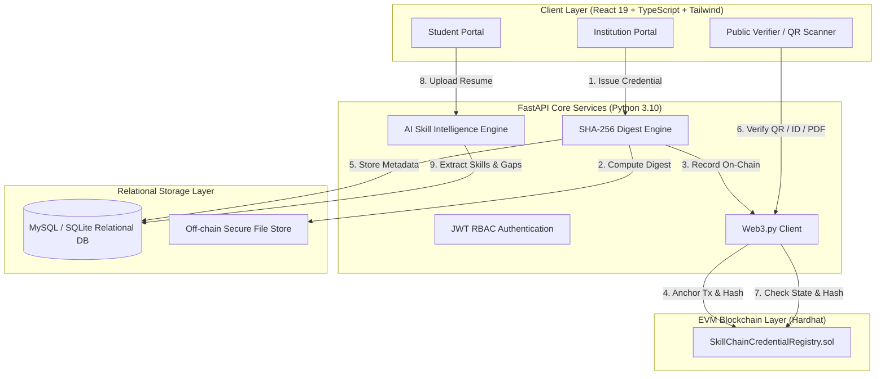
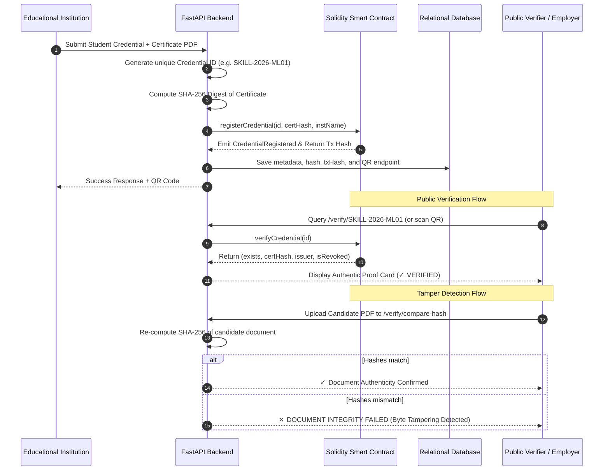
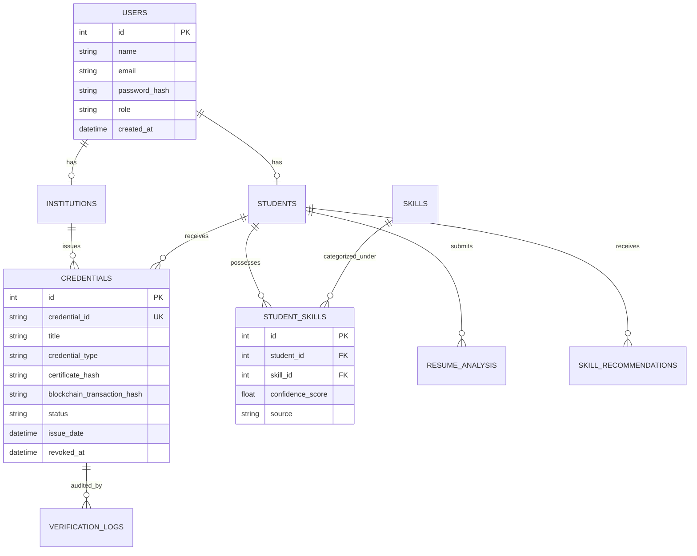

# SkillChain: Blockchain-Based Credential Verification & AI Skill Intelligence Platform
**"Proof of Skills. Powered by Blockchain."**

---

## 1. Project Overview & Architecture
SkillChain solves certification fraud and opaque resume claims through a dual-pillar decentralized framework:
1. **Blockchain Trust Layer:** Educational institutions issue verifiable academic credentials by anchoring cryptographic SHA-256 digests into an EVM Solidity smart contract. Sensitive candidate data and certificates remain strictly off-chain.
2. **AI Skill Intelligence Layer:** An automated NLP intelligence engine analyzes verified achievements and uploaded resumes to extract authentic technical competencies, compute statistical confidence indicators, and suggest career gap roadmaps.



---

## 2. Cryptographic Proof & Verification Workflow



---

## 3. Database Entity Relationship Model



---

## 4. Quick Start & Execution Guide

### Step 1: Start Hardhat Local Blockchain Node
```bash
cd blockchain
npx hardhat node
```

### Step 2: Deploy Solidity Smart Contract
In a separate terminal:
```bash
cd blockchain
npx hardhat run scripts/deploy.js --network localhost
```
*The script outputs the contract address (`0x5FbDB2315678afecb367f032d93F642f64180aa3`) and updates `deployment-info.json`.*

### Step 3: Run FastAPI Backend
```bash
cd backend
python -m uvicorn app.main:app --reload --port 8000
```
*Tables and realistic demo accounts are initialized automatically on boot.*

### Step 4: Run Vite React Frontend
```bash
cd frontend
npm run dev
```
Open **`http://localhost:5173`** in your browser.

---

## 5. Live Demonstration Checklist (Faculty & Judge Evaluation)

| Demo Phase | Action | System Output |
| :--- | :--- | :--- |
| **Demo 1: Authentic Verification** | Search `SKILL-2026-ML01` on `/verify` | Displays **✓ VERIFIED ON-CHAIN**, SHA-256 hash match, EVM transaction anchor, and student details. |
| **Demo 2: Revocation Test** | Search `SKILL-2026-REV05` on `/verify` | Displays **⚠ CREDENTIAL REVOKED**, revocation audit reason and timestamp. |
| **Demo 3: Tamper Detection** | Click "Verify File Integrity", target `SKILL-2026-ML01` & upload any modified/sample file | Displays **✕ DOCUMENT INTEGRITY FAILED**. The submitted SHA-256 hash deviates from the on-chain immutable root. |
| **Demo 4: AI Resume Parsing** | Login as Student (`alex@student.edu`), upload resume PDF | Extracts technical competencies, assigns confidence ratings, and flags career gaps. |
| **Demo 5: Issuance & Revocation** | Login as Issuer (`apex@skillchain.edu`), issue new credential, then revoke it | New cryptographic proof is generated, registered on-chain, and immediately verified. |

---

## 6. Pre-seeded Demo Credentials

- **Alex Rivera (Student):** `alex@student.edu` / `alex123`
- **Apex Institute (Issuer):** `apex@skillchain.edu` / `apex123`
- **Platform Administrator:** `admin@skillchain.edu` / `admin123`
